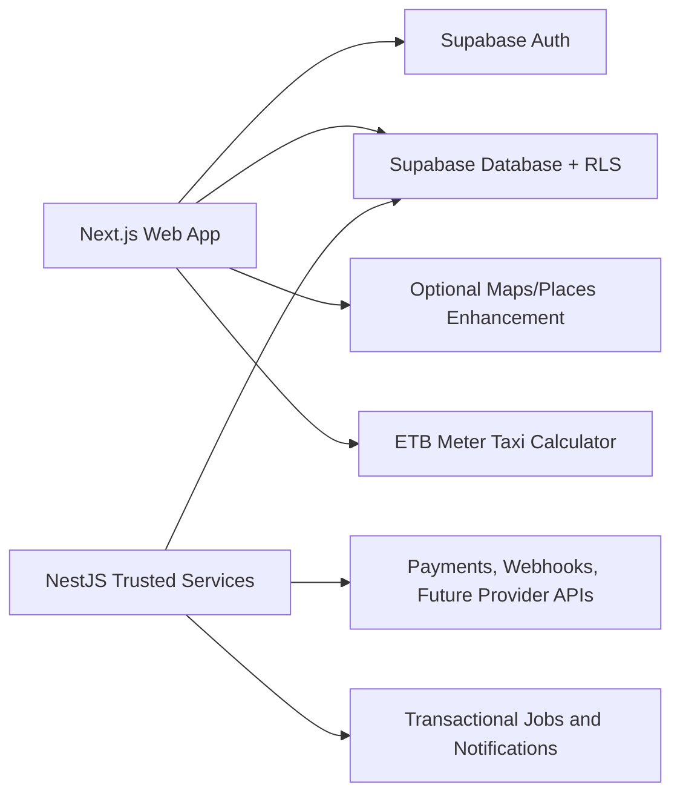

# UrbanExplore Implementation Plan

## Purpose

Deliver UrbanExplore as a full consumer and partner platform for discovering restaurants and events, managing reservations and ticketing, and calculating local ETB meter-taxi estimates.

This plan is based on the current repository audit and the agreed architecture decision:

- Supabase Auth owns identities and sessions.
- Supabase Database is the single source of truth for all persistent product data.
- The Next.js application reads and writes through RLS-protected Supabase access patterns.
- NestJS is retained only for trusted server-side work such as webhooks, integration adapters, and concurrency-sensitive operations that cannot safely run in the browser.
- Prisma is a migration reference for existing local data, not the long-term product database contract.

## Current State

### Working Foundations

- The Next.js web application builds successfully and is deployed through Netlify.
- Supabase email/password and Google OAuth UI flows exist.
- Consumer, food-business, and event-organizer onboarding screens exist.
- Public home, restaurant, event, ride, legal, and account pages exist.
- Restaurant, organizer, and admin dashboard shells exist.
- NestJS modules for auth, users, partners, reservations, events, and rides compile.
- Prisma seed data exists for local development.
- Manual ETB meter-taxi fare estimation works without requiring Google Maps.

### Major Gaps

- The Supabase schema, migrations, and RLS policies are not tracked in the repository.
- Consumer users do not reliably receive a `profiles` record after signup.
- The web application uses Supabase tables while public catalogues and backend workflows use a separate Prisma/Nest database.
- This split makes data inconsistent: partner dashboard records are not guaranteed to appear in consumer discovery.
- Reservation capacity, ticket inventory holds, checkout state, and notifications are incomplete.
- Restaurant and organizer dashboard metrics contain placeholders rather than real aggregates.
- Admin links exist but the management pages are not implemented.
- Subscription plans, offers, featured listings, and promotion tools are only represented in UI or metadata.
- Google Maps integration is optional and currently unreliable; it must not block the ride calculator.
- There are no meaningful automated tests, CI workflows, production monitoring, or migration verification gates.

## Product Scope

### Consumer Experience

- Sign up, sign in, sign out, profile editing, saved items, and booking/ticket history.
- Browse, search, filter, and view restaurant and event listings.
- View restaurant menus, availability, booking policies, and reservation status.
- View event details, ticket tiers, purchase state, and attendance/ticket history.
- Calculate ETB meter-taxi estimates by manual distance, with location/maps as optional enhancement.

### Restaurant Partner Experience

- Business onboarding and verification-ready profile data.
- Multi-branch setup, operating hours, capacity, booking configuration, and menus.
- Public restaurant listing creation and management.
- Reservation confirmation, rejection, cancellation, and status management.
- Real booking, customer, and revenue-related operational metrics.
- Plan entitlements, offers, promotion requests, and featured listing controls.

### Event Organizer Experience

- Organizer onboarding and organization profile management.
- Event draft, publish, cancel, and completion lifecycle.
- Ticket tier configuration, inventory, holds, checkout state, QR issuance, and attendance state.
- Sales, ticket, attendance, and campaign analytics.
- Plan entitlements, promotions, and featured placement controls.

### Platform Administration

- User, business, organizer, listing, event, promotion, and moderation management.
- Role-aware platform metrics and audit history.
- Controlled bootstrap process for system administrators.

## Architecture Target

### Data Ownership

| Concern | Owner | Notes |
| --- | --- | --- |
| Credentials, sessions, OAuth | Supabase Auth | Retire custom Nest password and refresh-token ownership. |
| Profiles and roles | Supabase `profiles` | Linked one-to-one with `auth.users`. |
| Listings, menus, reservations | Supabase Database | Governed by RLS and transactional RPCs. |
| Events, tickets, purchases | Supabase Database | Ticket inventory changes must be transactional. |
| Ride calculator/configuration | Supabase Database or static configuration | Maps must remain optional. |
| Webhooks and external integrations | NestJS | Validate Supabase JWTs where authenticated API access is required. |
| Payments | Deferred | Model payment states now; add settlement provider later. |

## Implementation Phases

## Phase 1: Supabase Foundation

### Goal

Create the versioned, secure database contract that all later product work depends on.

### Work

1. Add `packages/supabase/migrations/` and a documented migration workflow.
2. Define enums, constraints, timestamps, indexes, and foreign keys for:
   - `profiles`
   - `businesses`
   - `branches`
   - `booking_configs`
   - `restaurants`
   - `menu_items`
   - `organizers`
   - `events`
   - `ticket_types`
   - `ticket_holds`
   - `ticket_purchases`
   - `reservations`
   - `ride_search_logs`
   - `offers`
   - `promotions`
   - `subscriptions`
   - `audit_logs`
3. Add RLS policies for anonymous discovery, authenticated consumers, restaurant owners, organizers, and administrators.
4. Create a trigger or trusted provisioning path that creates exactly one `profiles` row for every new Supabase user.
5. Persist role, language, country, profile details, and onboarding metadata through a defined schema instead of only user metadata.
6. Add database views or RPC functions for public catalogues, dashboard metrics, reservation availability, and ticket inventory transactions.

### Acceptance Criteria

- An empty Supabase project can be migrated using only files in this repository.
- A new user receives a profile row and correct role automatically.
- Anonymous users can read only published public listings.
- Partners can only change their own records.
- Admin-only records and actions are denied to non-admins.

## Phase 2: Data Migration and Development Fixtures

### Goal

Make Supabase authoritative without keeping long-term duplicate records in Prisma and Supabase.

### Work

1. Map the Prisma schema and current seed entities into the new Supabase tables.
2. Add an idempotent development fixture script for Supabase.
3. Add a controlled one-time data-import script from the Prisma/local database.
4. Validate row counts, ownership, foreign keys, and public listing visibility after import.
5. Document local development, staging, and production fixture policy.
6. Stop using destructive seed deletes outside disposable local environments.

### Acceptance Criteria

- Sample users, businesses, branches, restaurants, reservations, events, ticket tiers, purchases, and ride data appear in Supabase.
- A partner listing created through the web UI is visible to the consumer catalogue.
- Prisma data is no longer treated as the active product source after migration.

## Phase 3: Unified Web Data Access

### Goal

Replace scattered and conflicting data access with consistent, typed Supabase access.

### Work

1. Create feature-scoped repositories or server actions for profiles, discovery, reservations, events, tickets, and partner operations.
2. Replace production fallback reads from `NEXT_PUBLIC_API_URL` for restaurants/events with Supabase catalogue queries or views.
3. Add Zod validation at form and server-action boundaries.
4. Add common loading, empty, error, retry, and permission-denied states.
5. Add pagination, text search, category filters, location filters, and date filters to consumer catalogues.
6. Remove direct table access from components where it duplicates business rules.

### Acceptance Criteria

- Public discovery reads use only the versioned Supabase contract.
- Dashboard writes are validated and RLS-protected.
- No production page silently falls back to `localhost`.
- A failure in one data source cannot crash public navigation or unrelated pages.

## Phase 4: Identity and Profile Completion

### Goal

Make all roles usable after signup and ensure account data is reliable.

### Work

1. Update auth callback handling for consumer, food-business, organizer, and Google OAuth users.
2. Create/update profiles for full name, phone, city, language, country, dietary preferences, allergies, gender, and birth date.
3. Create partner business/organizer records through secure server actions or database functions.
4. Update settings to edit persisted profile fields.
5. Ensure middleware and dashboard routing rely on the provisioned profile role.
6. Add session refresh, sign-out, redirect URL, and callback error handling.

### Acceptance Criteria

- Each role completes signup and lands in the correct product area.
- Role routing survives refresh and new browser sessions.
- Consumer metadata is persisted in database records, not only temporary UI state.

## Phase 5: Restaurant Operations

### Goal

Deliver usable restaurant partner workflows and safe consumer reservations.

### Work

1. Complete business and branch onboarding.
2. Configure operating hours, slot duration, party size limits, advance notice, booking mode, cancellation policy, and capacity.
3. Complete restaurant listing and menu CRUD.
4. Implement consumer restaurant details, menus, availability checks, reservation creation, and reservation history.
5. Implement partner reservation inbox with confirm, reject, cancel, completed, and optional suggested-time actions.
6. Replace hardcoded metrics with real Supabase aggregates.
7. Eliminate N+1 reservation/profile queries through views, joins, or RPCs.
8. Implement atomic capacity checks through a Supabase RPC/transaction strategy so concurrent requests cannot overbook a slot.
9. Add reservation notifications/status events.

### Acceptance Criteria

- A consumer can reserve an available time slot.
- A restaurant partner can manage the reservation lifecycle.
- Capacity cannot be exceeded under concurrent requests.
- Restaurant dashboard metrics reflect real reservations.

## Phase 6: Event and Ticketing Operations

### Goal

Deliver organizer event management and safe ticket inventory handling.

### Work

1. Complete event lifecycle states: draft, published, cancelled, completed.
2. Complete event listing, edit, publish, and public detail flows.
3. Add ticket tiers, pricing, capacity, sale windows, and remaining inventory.
4. Implement ticket hold with expiry and checkout intent/purchase state.
5. Generate ticket/QR identifiers and attendance scan state.
6. Implement organizer metrics for sales, tickets, attendance, and event status.
7. Add atomic ticket inventory RPCs/transactions to prevent overselling.
8. Model payment states as pending, paid, failed, refunded, and cancelled until a payment provider is selected.

### Acceptance Criteria

- An organizer can publish an event and configure ticket tiers.
- A consumer can reserve/purchase a ticket state without inventory oversell.
- A ticket has unique identifier and attendance state.
- Organizer analytics are based on stored event and purchase records.

## Phase 7: Consumer Discovery and Engagement

### Goal

Make the consumer side complete and connected to partner data.

### Work

1. Add robust restaurant/event search, filters, sorting, and pagination.
2. Complete restaurant and event detail pages using Supabase data.
3. Add saved/followed restaurants/events and user history.
4. Add booking and ticket entry points from discovery pages.
5. Add clear operational states for unpublished, unavailable, sold-out, cancelled, and completed records.
6. Add accessible mobile behavior and page-level error boundaries.

### Acceptance Criteria

- Consumer discovery reflects partner-created published records.
- Saved/followed items and histories persist per user.
- Empty, unavailable, and sold-out states are explicit and usable.

## Phase 8: Rides and Local Taxi Pricing

### Goal

Provide a dependable Ethiopia-focused fare estimate flow without relying on Google Maps availability.

### Work

1. Keep manual distance entry as the mandatory functional path.
2. Store configurable meter-taxi rate rules, beginning with ETB 90 base fare and per-kilometer rates by tier.
3. Clearly show fare assumptions and currency in the UI.
4. Record authenticated searches only with appropriate user disclosure.
5. Treat Google Maps/Places as optional progressive enhancement for location selection.
6. Defer turn-by-turn route geometry and real ride-provider integrations until API budget and provider agreements are available.

### Acceptance Criteria

- A user can calculate ETB fare estimates with only a distance value.
- Maps failure does not disable fare calculation.
- Rate changes can be managed without redeploying client code.

## Phase 9: Commercial Partner Features

### Goal

Implement the full partner-platform business model.

### Work

1. Define plan entitlements for free, premium monthly, and premium yearly plans.
2. Add subscription status, effective dates, entitlement checks, and audit records.
3. Add restaurant offers/deals and organizer promotions.
4. Add featured listing and sponsored placement request workflows.
5. Add visibility/ranking controls that are enforced consistently in discovery queries.
6. Gate premium features through a single entitlement policy.
7. Defer actual subscription payment collection until a payment provider is selected.

### Acceptance Criteria

- Partner plan features are not controlled by UI-only checks.
- Offers and promotions have owner, lifecycle, visibility, and audit data.
- Discovery ranking follows published entitlements and moderation status.

## Phase 10: Administration and Moderation

### Goal

Provide safe platform operations for administrators.

### Work

1. Implement missing admin pages for users, businesses, organizers, restaurants, events, offers, and promotions.
2. Add moderation states and activation/deactivation controls.
3. Add platform metrics derived from real records.
4. Add audit logs for administrative and moderation actions.
5. Enforce admin access through RLS and server-side authorization.

### Acceptance Criteria

- Admin links resolve to functioning management pages.
- Unauthorized users cannot read or mutate administration data.
- Moderation actions are auditable.

## Phase 11: Deployment, Security, and Operations

### Goal

Make the platform safe to run and easy to validate across environments.

### Work

1. Add `netlify.toml` and update deployment documentation for the web application.
2. Document Supabase redirect URLs, Netlify variables, optional Maps configuration, and retained backend variables.
3. Add least-privilege environment handling and rotate previously exposed secrets.
4. Add CORS allowlists for retained NestJS endpoints.
5. Add health/readiness endpoints and structured error logging for server-side functions.
6. Add request timeouts and user-safe failure states for external calls.
7. Remove stale instructions that require local Docker/Prisma services for core web functionality.
8. Add monitoring and alerting provider configuration.

### Acceptance Criteria

- A new environment can deploy from repository documentation without unpublished schema steps.
- No secret is committed to Git or required in browser-only code except intended public keys.
- Staging deployment does not use localhost API fallbacks.

## Phase 12: Tests and Continuous Integration

### Goal

Make changes safe as the platform becomes more complex.

### Work

1. Add unit tests for fare calculations, Zod schemas, profile provisioning rules, entitlements, and status transitions.
2. Add integration tests against a disposable/local Supabase environment for RLS, reservations, and ticket inventory RPCs.
3. Add browser E2E tests for:
   - consumer signup and profile creation
   - consumer reservation flow
   - consumer ticket flow
   - restaurant partner setup and reservation management
   - organizer event publishing and ticket analytics
   - admin moderation
   - manual ETB fare calculation without Maps
4. Add GitHub Actions for build, lint, tests, migration verification, and secret scanning.
5. Require migration review and successful checks before deploy.

### Acceptance Criteria

- Pull requests fail when migrations, builds, RLS tests, or core browser flows fail.
- Critical concurrency workflows have automated regression coverage.

## Dependency Order

1. Phase 1 blocks all product work.
2. Phase 2 depends on Phase 1.
3. Phases 3 and 4 depend on Phases 1 and 2.
4. Phases 5 and 6 can proceed in parallel after Phases 3 and 4.
5. Phases 7, 8, 9, and 10 depend on the relevant stable entities from Phases 5 and 6.
6. Phases 11 and 12 begin immediately and continue throughout implementation.

## Verification Checklist

1. Apply Supabase migrations to a clean project.
2. Confirm all RLS policies with anonymous, customer, restaurant partner, organizer, and admin accounts.
3. Confirm auth callback creates exactly one profile and appropriate partner record.
4. Run concurrent reservation and ticket-hold tests to prove inventory cannot be oversold.
5. Run web build and retained backend build after each relevant change.
6. Run browser E2E tests for all four roles and the manual ride calculator.
7. Run a staging deployment rehearsal with Netlify and Supabase before production release.

## First Implementation Slice

The first code slice after this plan should be **Phase 1: Supabase Foundation**:

1. Add the versioned Supabase migration folder and migration tooling.
2. Define `profiles` with roles and automatic provisioning from `auth.users`.
3. Define the initial public catalogue tables: businesses, restaurants, organizers, events.
4. Add RLS policies for public reads and partner ownership.
5. Add an idempotent development fixture.
6. Validate a clean Supabase project migration before touching dashboard or consumer feature code.
